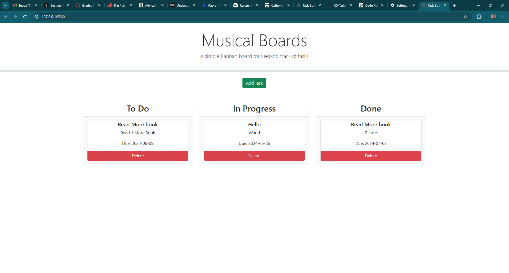

# Musical Boards C5 Project

Musical Boards is a simple Kanban-style task management application that allows users to add, delete, and organize tasks into different statuses: To Do, In Progress, and Done. Tasks are color-coded based on their due dates, with overdue tasks marked in red and tasks due today marked in yellow.

## Features

- **Add Tasks**: Create new tasks with a title, description, and deadline.
- **Delete Tasks**: Remove tasks from the board.
- **Drag and Drop**: Move tasks between "To Do", "In Progress", and "Done" columns.
- **Persistent Storage**: Tasks are saved in the browser's local storage.

## Technologies Used

- **HTML/CSS**: For structuring and styling the application.
- **JavaScript/jQuery**: For DOM manipulation and event handling.
- **jQuery UI**: For draggable and droppable functionalities.
- **Day.js**: For date manipulation.
- **Bootstrap**: For responsive design and styling.

### Usage

1. Open the `index.html` file in your web browser.
2. Use the "Add Task" button to open the task form modal.
3. Fill out the form with task details and submit to add the task to the "To Do" column.
4. Drag tasks between columns to update their status.
5. Click the "Delete" button on a task to remove it from the board.

## Example with link to website
[Github URL](https://mountainmancodes.github.io/Musical-Board/)

## License

This project is licensed under the MIT License - see the LICENSE file for details.

## Acknowledgements

- [jQuery](https://jquery.com/)
- [jQuery UI](https://jqueryui.com/)
- [Day.js](https://day.js.org/)
- [Bootstrap](https://getbootstrap.com/)
- [Lixiviate](https://github.com/Lixiviate)
